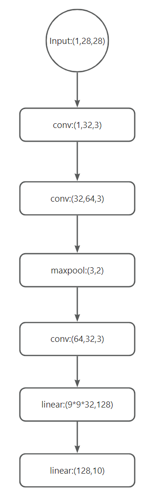

# 实验介绍
基于Pytorch深度学习框架实现MNIST手写数字识别，并用TensorRT进行加速。

# 开发环境
- windows 11
- pytorch 1.12.0
- torchvision 0.13.0 
- python 3.7.13
- tensorboard 1.15.0
- tensorboardx 2.5.1
- tensorrt 8.6.1.6

# 网络架构
自己搭建了两种简单的网络:

- 使用五层简单的Linear算子搭建，后面统称该网络为网络一：


- 使用三层Conv算子加两层Linear算子搭建，后面统称该网络为网络二：
 


备注：    
Linear(输入数据大小，输出数据大小)    
Conv(输入通道数，输出通道数，卷积核大小，步长（默认为1）)    
MaxPool(池化核大小，步长)
# 实验结果
损失loss：
<p align="center">
  
</p>
精度acc：
<p align="center">
  
</p>
不同学习率以及epoch对应的网络精度如下表所示：

| 网络 | learning rate | epoch | 测试集最大acc |
| --- | --- | --- | --- |
| 网络一 | 5e-03 | 10 | 98.32% |
| 网络一 | 1e-03 | 20 | 98.63% |
| 网络一 | 1e-03 | 40 | 98.57% |
| 网络一 | 5e-04 | 20 | 98.65% |
| 网络一 | 5e-04 | 40 | 98.75% |
| 网络二 | 5e-03 | 10 | 99.39% |
| 网络二 | 1e-03 | 20 | 99.46% |
| 网络二 | 1e-03 | 40 | 99.49% |
| 网络二 | 5e-04 | 20 | 99.57% |
| 网络二 | 5e-04 | 40 | 99.46% |

# 脚本运行
启动训练(评估会在每个epoch结束之后评估一次)：
```python
python trainer.py -m 0 -l 1e-03 -e 20
```
命令行参数解释:

| 参数简称 | 参数全称 | 参数含义                              |
| --- | --- |-----------------------------------|
| -m | --model | 网络运行时选用的模型。0：选用网络一；1：选用网络2，默认值为1。 |
| -l | --lr_rate | 学习率，默认值为5e-04。                    |
| -e | --epoch | epoch数，默认值为20。                    |

启动推理：
```python
python infer.py
```

构建trt模型：
```python
python build_trt_net.py
```

推理trt模型：
```python
python trt_infer.py
```