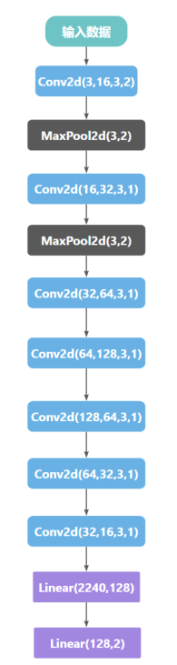
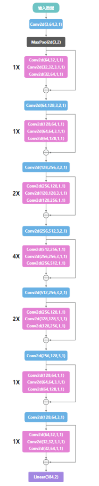

# 实验介绍

pytorch实现狗品种二分类以及tensorrt加速

# 开发环境

- windows 11
- pytorch 1.12.0
- torchvision 0.13.0
- python 3.7.13
- tensorboard 1.15.0
- tensorboardx 2.5.1

# 数据集介绍

使用Imagewoof数据集，这是一个由旧金山大学于2020年发布的狗十分类数据集。主要品种有：澳大利亚梗、边境梗、萨摩耶、比格犬、西施犬、英国猎狐犬、罗得西亚脊背犬、澳洲野狗、金毛猎犬、古英国牧羊犬。本实验选取了澳大利亚梗跟萨摩耶做二分类。    
下载路径：https://www.aliyundrive.com/s/iVwzXD28suG  ，验证码：h80q

# 网络架构

实验过程中一共使用了四种不同的网络，即net9、net44、resnet18、resnet34以及resnet50。

- net9为自己设计的简单网络，一共有9层，其对应于代码中的Net1：

<p>
    
</p>

- net44也为自己设计的网络，一共有44层，其中使用了残差块，其对应于代码中的Net2：

<p>
    
</p>

- resnet18、resnet34以及resnet50为pytorch自带的预训练网络，其对应于代码中的Net3。

备注：    
Linear(输入数据大小，输出数据大小)    
Conv2d(输入通道数，输出通道数，卷积核大小，步长（默认为1）)    
MaxPool2d(池化核大小，步长)

# 脚本运行

启动resnet34训练脚本(评估会在每个epoch结束之后评估一次)：

```python
python main.py -m 3 -t 34 -dp datasets所在路径
```

命令行参数解释:

| 参数简称 | 参数全称          | 参数含义                                                                              |
|------|---------------|-----------------------------------------------------------------------------------|
| -m   | --model       | 网络运行时选用的模型。1：选用net9；2：选用net44；3：选用resnet系列网络，默认值为3。                               |
| -c   | --channels    | 训练时图片的通道数。1：使用单通道图片，3：使用三通道图片，默认值为3。                                              |
| -t   | --type        | resnet网络的类型，只有在使用resnet为backbone时才会用到。18:resnet18,34:resnet34,50:resnet50，默认值为34。 |
| -l   | --lr_rate     | 学习率，默认值为8e-05。                                                                    |
| -e   | --epoch       | epoch数，默认值为30。                                                                    |
| -p   | --pth_name    | 保存的权重名称。                                                                          |
| -bs  | --batch_size       | batch size数，默认值为32。                                                               |
| -gm  | --gamma       | ExponentialLR中使用的超参gamma，默认值为0.99。                                                |
| -dp  | --datasets_path       | 数据集路径。                                                                            |
| -n   | --num_classes       | 分类数，默认值为2。                                                                        |

启动resnet34评估脚本：

```python
python detector.py -m 3 -dp datasets所在路径
```

命令行参数解释:

| 参数简称 | 参数全称          | 参数含义                                                                              |
|------|---------------|-----------------------------------------------------------------------------------|
| -m   | --model       | 网络运行时选用的模型。1：选用net9；2：选用net44；3：选用resnet系列网络，默认值为3。                               |
| -c   | --channels    | 训练时图片的通道数。1：使用单通道图片，3：使用三通道图片，默认值为3。                                              |
| -t   | --type        | resnet网络的类型，只有在使用resnet为backbone时才会用到。18:resnet18,34:resnet34,50:resnet50，默认值为34。 |
| -p   | --pth_name    | 保存的权重名称。                                                                          |
| -dp  | --datasets_path       | 数据集路径。                                                                            |
| -n   | --num_classes       | 分类数，默认值为2。                                                                        |

# 实验结果

在学习率为8e-05、epoch为30以及batch size为32时,不同的网络不使用数据增强训练三通道图片的精度如下表所示：

| 网络       | 测试集最大acc |
|----------|----------|
| net9     | 93.42%   |
| net44    | 93.21%   |
| resnet18 | 99.15%   |
| resnet34 | 99.58%   |
| resnet50 | 99.79%   |

# TensorRT加速
## 1.Python版本
### 加速环境

- Windows 11
- NVIDIA GeForce RTX 3060
- python 3.7.13
- TensorRT 8.4.1.5
- cuda 11.6
- cudnn 8.4
- onnxruntime 1.12.1

### pth权重文件转onnx权重文件
```python
python to_onnx.py --torch_file_path pth文件路径 --onnx_file_path onnx文件输出路径
```

### onnx文件转trt文件
使用TensorRT/bin目录下的trtexec进行模型转换（默认情况下转换为TF32数据格式）：
```bash
.\trtexec.exe --onnx=onnx文件路径 --saveEngine=trt文件输出路径 --workspace=6000
```

float16转换:
```bash
.\trtexec.exe --onnx=onnx文件路径 --saveEngine=trt文件输出路径 --workspace=6000 --fp16
```

int8转换:
```bash
.\trtexec.exe --onnx=onnx文件路径 --saveEngine=trt文件输出路径 --workspace=6000 --int8
```

### python调用trt文件进行推理
```python
python trt_infer.py --trt_file_path trt文件路径 -dp datasets所在路径
```

### 实验结果

| 模型                     | acc        | 平均latency（单位s）    | 文件大小（单位MB）  |
|------------------------|------------|-------------------|-------------|
| resnet34-xxx.pth       | 99.58%     | 0.004614          | 81.3        |
| resnet34-xxx.trt(tf32) | 99.58%     | 0.000749          | 115         |
| resnet34-xxx-fp16.trt  | 99.58%     | 0.000557          | 41.0        |
| resnet34-xxx-int8.trt  | **99.79%** | **0.000452**      | **20.7**    |

### 该部分参考博客
https://zhuanlan.zhihu.com/p/467401558    
https://zhuanlan.zhihu.com/p/371239130   
https://zhuanlan.zhihu.com/p/527238167   

## 2.C++版本
仍在实验当中